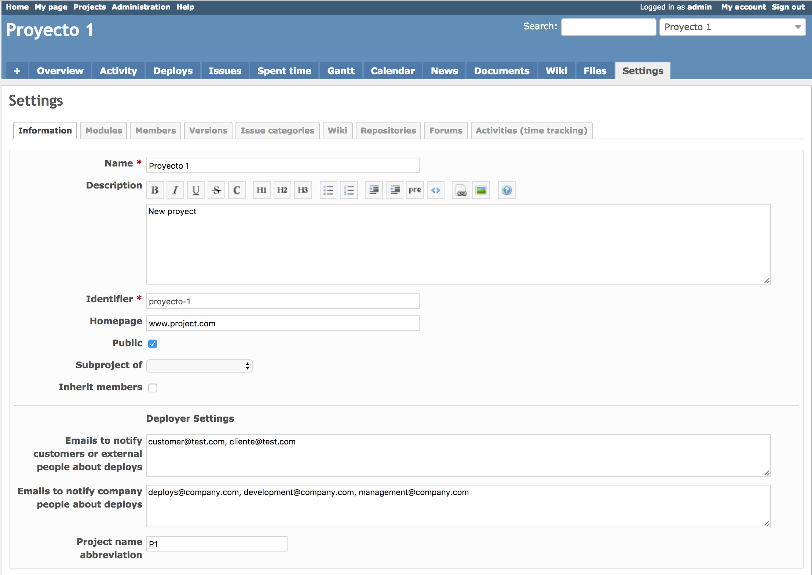
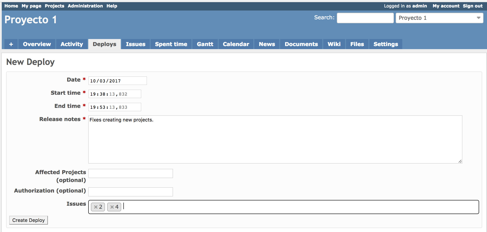
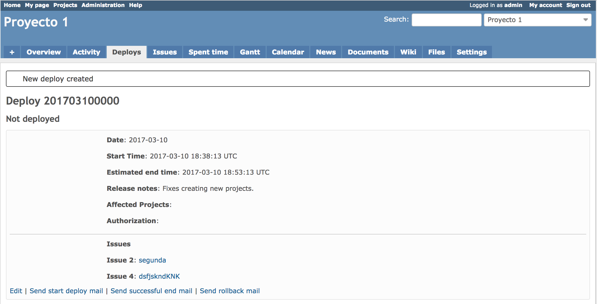
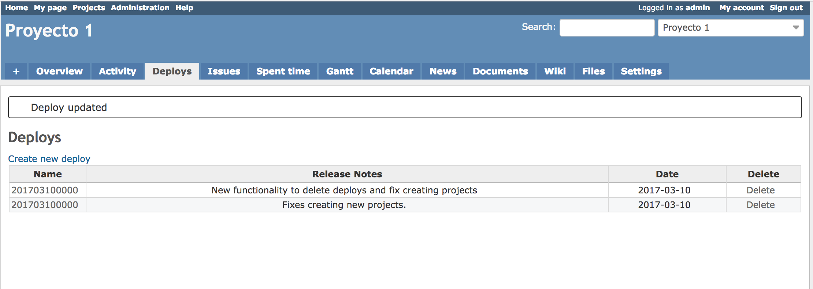
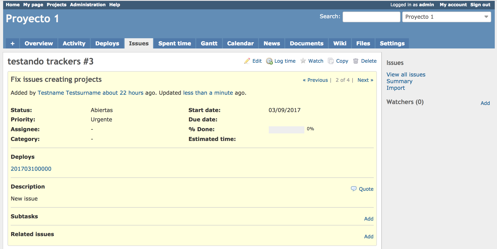
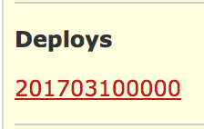
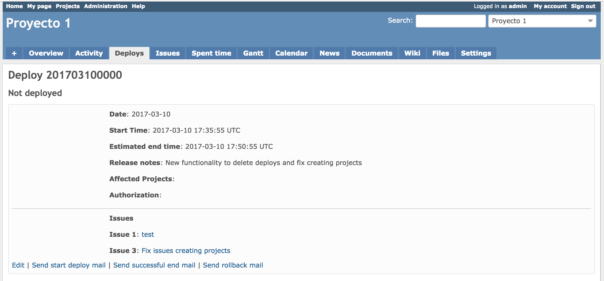
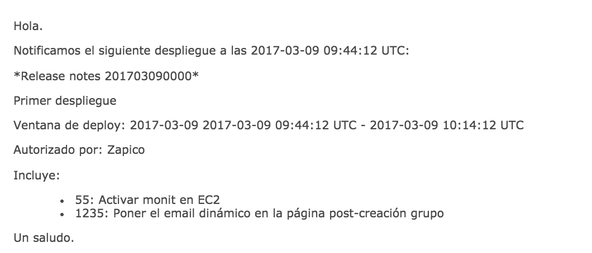

# Deployer
Redmine plugin to group issues into deploys and send notifications (e-mails) when needed

## Install
* Copy project into your redmine plugins folder.

* Run rake redmine:plugins:migrate

* Enjoy

## Screenshots

### Settings

Deployer adds a new section for each project settings. Customer's email addresses, development/management teams emails addresses and project abbreviation (to be notified before and after deployment).

### Create new deploy

Deployer allows you to create new deploys with an expected deploy date, start time, end time, release notes with details, affected "projects" (not redmine projects) and the person who authorizes the deploy (if needed). Finally, it allows you to search issues to be added to each deploy by its id.

### Deploy detail

When you open a deploy, you can see its data, specially its issues, with working links to each included issue.

### Deploys index

You can see deploys index by project. In this list you can see their names, release notes, date and a link to delete the deploy.

The deploy name is auto-calculated concatenating year, month, day and start time (hours and minutes).

### Issues detail

When you visit any issue included in any deploy (or many deploys), you can see a list of links to these deploys (and follow the links too).

### Send notifications and change state

You can send notifications to clients and team members by pressing links in detail view (Send start deploy, send successful end, send rollback). Pressing each of these links will trigger mail sendings to emails set in project settings.

